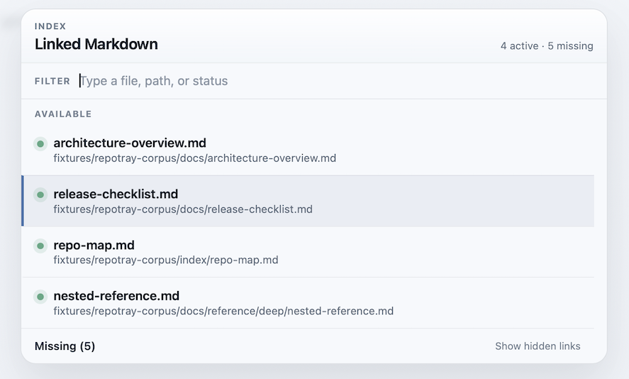

# MarkEdit-linktray

**Your notes already know where they point. MarkEdit-linktray just asks them.**

A [MarkEdit](https://github.com/MarkEdit-app/MarkEdit) extension that reads the links in your current Markdown note and drops them into a keyboard-first quick switcher. One shortcut, every linked file, no hunting.



---

## Install

Download [`markedit-linktray.js`](dist/markedit-linktray.js) and drop it into MarkEdit's scripts folder:

```sh
cp markedit-linktray.js \
   ~/Library/Containers/app.cyan.markedit/Data/Documents/scripts/
```

Restart MarkEdit. The command appears under **Extensions > Open Linked Markdown**.

To build from source instead:

```sh
npm install && npm run build
```

---

## Usage

| Key | Action |
|-----|--------|
| `Shift+Command+L` | Open the switcher |
| Type | Filter by filename, path, or status |
| `Arrow Up / Down` | Move through the list |
| `Enter` | Open the selected note |
| `Enter` on **Missing (N)** | Expand or collapse missing links |
| `Escape` | Close |

MarkEdit-linktray parses both `[label](path.md)` and `[[wiki]]` links, including targets with anchor fragments (`file.md#heading`) and parentheses in filenames. Paths are repo-relative when a `.git` root is discoverable, document-relative otherwise. Green dot means the file exists. Red dot means it doesn't — yet.

> **Note:** MarkEdit sandboxes file access. If a linked note won't open, grant its parent folder access in MarkEdit preferences.

---

## Development

```sh
npm install       # dependencies
npm test          # 36 tests, fast
npm run build     # -> dist/markedit-linktray.js
```

---

## What's Next

- Live refresh while you type
- Create missing files from the switcher
- Better feedback when `openFile` can't reach a target

---

## Contributing

MarkEdit-linktray is small on purpose. If you have an idea, [open an issue](https://github.com/BigCactusLabs/MarkEdit-linktray/issues) first. It's easier to align on direction before writing code.

Bug reports and PRs are welcome.

---

## License

MIT — see [LICENSE](LICENSE).
